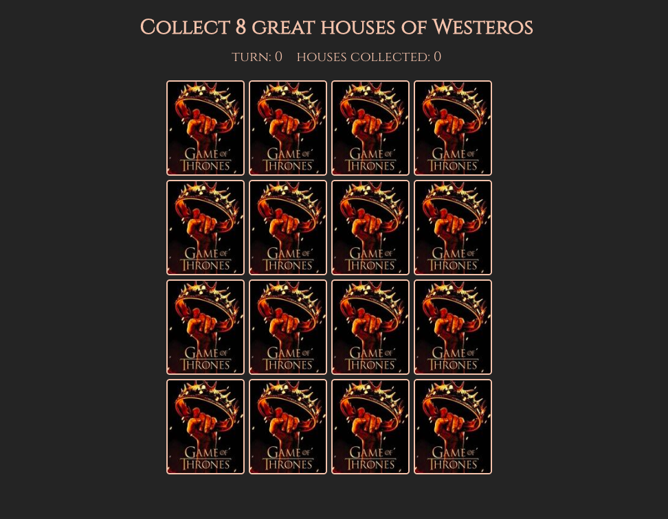

# memory-game
React.js matching game made during my Bootcamp 

## General info
This is a game where you need to match pairs of tiles - turn over one and then try to find a matching tile.

## Screenshots

## Setup
Clone this repo to your desktop and run `npm install` to install all the dependencies.

As soon as the dependencies are installed, you can run `npm start` to start the application. After that you will be able to browse it at localhost:3000
